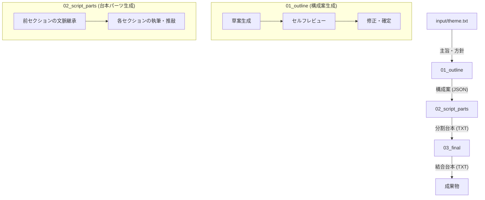

# thb-footage: YouTube台本自動生成システム

YouTubeの実話ストーリー解説系動画の台本制作を自動化するPythonツールです。 Gemini APIを活用し、構成案の作成から詳細な台本の執筆までを連続的、または各工程ごとに実行できます。

## 特徴

- **推敲ループ（Refinement Loop）**: 各工程で AI が自ら内容を評価・修正し、品質を高めます。
- **文脈維持**: 台本を分割生成する際、直前の内容を保持し、ストーリーの一貫性を確保します。
- **パイプライン設計**: 工程ごとに独立して実行・再開が可能です。
- **Docker対応**: 実行環境の構築が容易です。

---

## 工程の流れとデータの受け渡し

本システムは以下のステップでデータを処理します。



### 1. 構成案生成 (`--step outline`)
- **入力**: テーマと方針が記されたテキストファイル (`input/theme.txt`)。
- **処理**: Gemini が動画の起承転結を考え、各セクションのタイトルと概要を作成。その後、自らレビューを行い、洗練された構成案（JSON）を出力します。
- **出力**: `output/01_outline/outline.json`

### 2. 台本パーツ生成 (`--step script`)
- **入力**: 構成案 (`outline.json`)。
- **処理**: セクションごとに台本文を作成。各パーツ生成時に「直前のパーツの台本」をコンテキストとして読み込ませ、口調や内容に矛盾が出ないようにします。各パーツもレビュー・修正の推敲プロセスを経ます。
- **出力**: `output/02_script_parts/part_01.txt`, `part_02.txt` ...

### 3. 結合 (`--step merge`)
- **入力**: 生成された全パーツ (`02_script_parts/*.txt`)。
- **処理**: 順序通りにテキストを結合し、最終的な台本を生成。
- **出力**: `output/03_final/final_script.txt`

---

## セットアップ

### 1. 環境設定
`.env.example` をコピーして `.env` を作成し、Gemini の API キーを設定します。

```bash
cp .env.example .env
# .env を編集して GOOGLE_API_KEY=YOUR_KEY を設定
```

### 2. Docker の起動
```bash
docker-compose build
```

---

## 使い方

### 全工程を一括実行
```bash
docker-compose run --rm app python main.py --step all --input input/theme.txt
```

### 特定の工程から実行
途中のプロセス（`outline.json` など）が既に存在する場合、そこから開始できます。

- **構成案生成のみ**:
  ```bash
  docker-compose run --rm app python main.py --step outline --input input/theme.txt
  ```
- **台本生成のみ** (構成案が既にある場合):
  ```bash
  docker-compose run --rm app python main.py --step script --input output/01_outline/outline.json
  ```
- **結合のみ** (パーツが既にある場合):
  ```bash
  docker-compose run --rm app python main.py --step merge --input output/02_script_parts
  ```

---

## カスタマイズ（プロンプト）

`prompts/` フォルダ内のテキストファイルを編集することで、AI の語り口調、動画のスタイル、レビューの厳しさなどを調整できます。

- `prompts/outline/`: 構成案の作成・レビュー用
- `prompts/script/`: 台本の執筆・レビュー用
"# thb-footage" 
