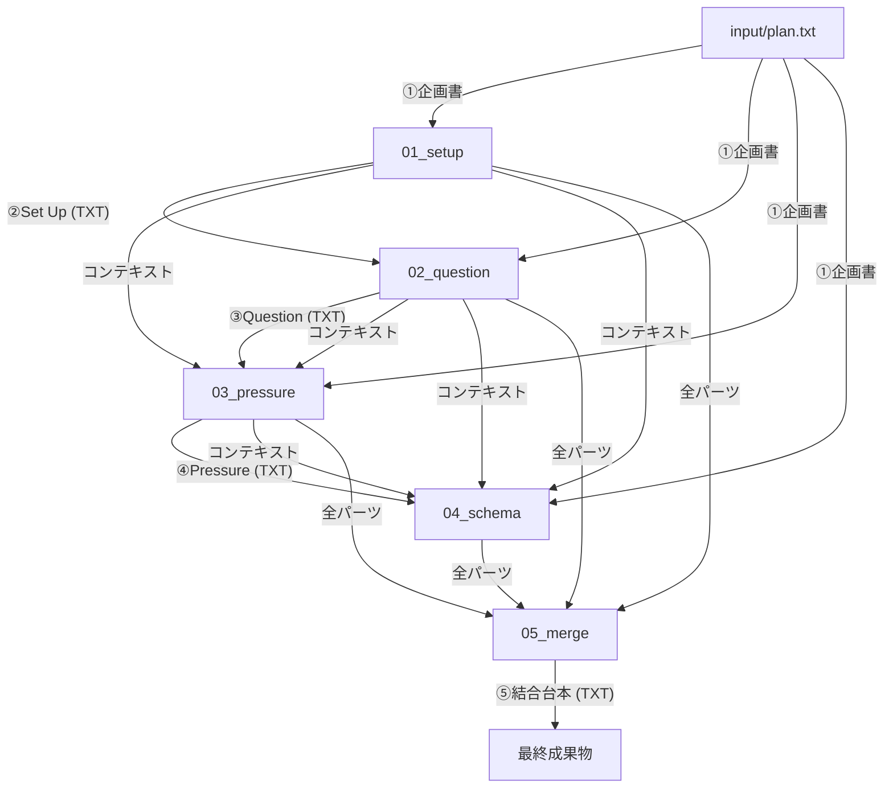

# thb-footage: YouTube台本自動生成システム

YouTubeの実話ストーリー解説系動画の台本制作を自動化するPythonツールです。視聴者の感情移入と緊張感を最大化する「4段階ナラティブ構成」を採用し、企画書から高品質な台本を生成します。

## 特徴

- **4段階のナラティブ・パイプライン**: 感情移入、具体的問い、葛藤の深化、解釈の逆転という強力なストーリーテリング手法に基づいた構成。
- **企画書からの直接生成**: 従来の「構成案」作成を廃止し、企画書から各パートを直接執筆することで、ストーリーの熱量と一貫性を維持します。
- **文脈の連鎖（Context Chain）**: 各ステップが前の展開を「文脈」として継承し、流れるようなストーリー構成を実現します。
- **柔軟な制御**: `control.json` により、全自動の `all` 実行から、特定のパートのみの修正まで自由に制御可能。

---

## ナラティブ構成の定義

本システムは以下の4つの物語段階を経て台本を完成させます。

1.  **Set Up（導入）**: 主人公に感情移入させ、視聴者を物語の当事者にする。
2.  **Dramatic Question（問い）**: 「YesかNoか」の具体的かつハイリスクな問いを提示し、視聴者を釘付けにする。
3.  **Pressure Chamber（葛藤）**: 抗えば抗うほど悪化する極限状況を描き、感情的な負荷を最大化する。
4.  **Schema Update（解決）**: 「解釈の逆転」を起こし、世界の見え方が書き換わるようなカタルシスを与える。

---

## 工程の流れとデータの受け渡し



## 各ステップの依存関係

| ステップ | 主な入力 | 生成される出力 |
| :--- | :--- | :--- |
| **Set Up** | `plan.txt` | `setup.txt` |
| **Question** | `plan.txt`, `setup.txt` | `question.txt` |
| **Pressure** | `plan.txt`, `setup.txt`, `question.txt` | `pressure.txt` |
| **Schema** | `plan.txt`, `setup.txt`, `question.txt`, `pressure.txt` | `schema.txt` |
| **Merge** | 上記全てのTXTファイル | `final_script.txt` |

---

## セットアップ

### 1. 環境設定
`.env.example` をコピーして `.env` を作成し、Gemini の API キーを設定します。

```bash
cp .env.example .env
# .env を編集して GOOGLE_API_KEY=YOUR_KEY を設定
```

### 2. Docker イメージのビルド
```bash
docker-compose build
```

---

## 使い方 (Docker)

本システムは、すべての工程制御を `config/control.json` で行います。

### 1. 実行手順

1.  **企画書を用意する**: `input/plan.txt` に動画のコンセプトを記入します。
2.  **制御設定を編集する**: `config/control.json` で `next_step` を指定します。
    *   `next_step`: `setup`, `question`, `pressure`, `schema`, `merge` または一括実行の `all`
3.  **コマンドを実行する**:
    ```bash
    docker-compose run --rm app python main.py
    ```

### 2. 工程の詳細

| 工程名 | `next_step` | 役割 |
| :--- | :--- | :--- |
| **Set Up** | `setup` | 主人公への感情移入と期待感の醸成。 |
| **Question** | `question` | 「Yes/No」で答える具体的かつハイリスクな問いの提示。 |
| **Pressure** | `pressure` | 主人公を追い詰め、感情負荷を最大化する葛藤描写。 |
| **Schema** | `schema` | 解釈の逆転と世界観の再構築を伴う解決。 |
| **Merge** | `merge` | 全パーツを統合し、一つの完成した台本を作成。 |
| **一括実行** | `all` | 全工程を最初から最後まで連続実行。 |

---

## プロンプトのカスタマイズ

`prompts/` フォルダ内の `draft.txt` を編集することで、各フェーズの出力トーンや詳細な指示を調整できます。

- **`{plan}`**: 企画書の内容が注入されます。
- **`{context}`**: それまでの展開（前のステップの出力）が注入され、一貫性を保ちます。

---

## 注意事項
- **Gemini APIの制限**: 生成AIの性質上、出力内容には揺らぎがあります。`config/settings.yaml` の `temperature` で調整してください。
- **ログの確認**: 各生成時のプロンプトと応答は `output/logs/` に詳細に保存されます。
