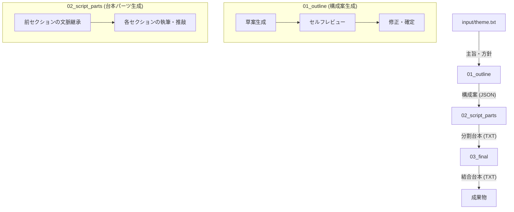

# thb-footage: YouTube台本自動生成システム

YouTubeの実話ストーリー解説系動画の台本制作を自動化するPythonツールです。 Gemini APIを活用し、構成案の作成から詳細な台本の執筆までを連続的、または各工程ごとに実行できます。

## 特徴

- **推敲ループ（Refinement Loop）**: 各工程で AI が自ら内容を評価・修正し、品質を高めます。
- **文脈維持**: 台本を分割生成する際、直前の内容を保持し、ストーリーの一貫性を確保します。
- **パイプライン設計**: 工程ごとに独立して実行・再開が可能です。
- **Docker対応**: 実行環境の構築が容易です。

---

## 設定（settings.yaml）

`config/settings.yaml` を書き換えることで、モデルや生成動作をカスタマイズできます。

### 1. モデル設定 (`model`)
- `name`: 使用する Gemini モデル（`gemini-1.5-flash`, `gemini-1.5-pro` など）。
- `temperature`: 生成の不確実性（0〜1）。高いほど創造的、低いほど堅実な出力になります。
- `top_p`, `top_k`: 生成精度のためのフィルタリング設定。通常はそのままで問題ありません。
- `max_output_tokens`: 1回のリクエストで出力される最大トークン数。

### 2. パス設定 (`paths`)
- `input_dir`, `output_dir`, `prompt_dir`: 各データの読み込み・保存先ディレクトリを指定します。

### 3. 推敲設定 (`refinement`)
- `max_retries`: （将来的な拡張）生成エラーや品質チェックでのリトライ回数。

---

## 工程の流れとデータの受け渡し

本システムは以下のステップでデータを処理します。



### 1. 構成案生成 (`--step outline`)
- **入力**: テーマと方針が記されたテキストファイル (`input/theme.txt`)。
- **データ例 (JSON)**:
  ```json
  {
    "title": "運に見放された男の奇跡",
    "sections": [
      {"title": "導入", "description": "最初の脱線事故のエピソード"},
      {"title": "不運の連続", "description": "飛行機墜落やバス事故の重なり"},
      {"title": "結末", "description": "宝くじ当選と人生の意義"}
    ]
  }
  ```
- **出力**: `output/01_outline/outline.json`

### 2. 台本パーツ生成 (`--step script`)
- **入力**: 構成案 (`outline.json`)。
- **データ例 (テキスト)**:
  ```text
  （part_01.txt の内容）
  みなさん、こんにちは。今日は「世界一不運」と呼ばれたある男の、信じられない実話をお話しします。
  1962年、凍てつくような冬の日。彼が乗った列車が冷たい川へと転落したところから、この数奇な物語は始まります...
  ```
- **出力**: `output/02_script_parts/part_01.txt`, `part_02.txt` ...

### 3. 結合 (`--step merge`)
- **入力**: 生成された全パーツ (`02_script_parts/*.txt`)。
- **データ例 (最終成果物)**:
  各パーツが結合され、一つの完成した台本になります。
- **出力**: `output/03_final/final_script.txt`

---

## セットアップ

### 1. 環境設定
`.env.example` をコピーして `.env` を作成し、Gemini の API キーを設定します。

```bash
cp .env.example .env
# .env を編集して GOOGLE_API_KEY=YOUR_KEY を設定
```

### 2. Docker の起動
```bash
docker-compose build
```

---

## 使い方

### 基本的な実行
```bash
docker-compose run --rm app python main.py [オプション]
```

### コマンドライン引数の詳細

| 引数 | 説明 | デフォルト値 |
| :--- | :--- | :--- |
| `--step` | 実行する工程を指定（`all`, `outline`, `script`, `merge`） | `all` |
| `--input` | 入力ファイルまたは中間データのディレクトリパス | `input/theme.txt` |
| `--config` | 設定ファイル（settings.yaml）のパス | `config/settings.yaml` |

#### `--step` ごとの `--input` の指定方法

- **`all` / `outline` の場合**:
    動画のテーマ・方針が書かれたテキストファイルのパスを指定します。
- **`script` の場合**:
    前の工程で生成された構成案ファイル（`outline.json`）のパスを指定します。
- **`merge` の場合**:
    生成された台本パーツが格納されているディレクトリのパスを指定します。

### 実行例

- **全行程を一括実行**:
  ```bash
  docker-compose run --rm app python main.py --step all --input input/theme.txt
  ```
- **構成案から台本を生成** (既存のJSONを使用):
  ```bash
  docker-compose run --rm app python main.py --step script --input output/01_outline/outline.json
  ```
- **最終結合のみ実行**:
  ```bash
  docker-compose run --rm app python main.py --step merge --input output/02_script_parts
  ```

---

## カスタマイズ（プロンプト）

`prompts/` フォルダ内のテキストファイルを編集することで、AI の語り口調、動画のスタイル、レビューの厳しさなどを調整できます。

- `prompts/outline/`: 構成案の作成・レビュー用
- `prompts/script/`: 台本の執筆・レビュー用
