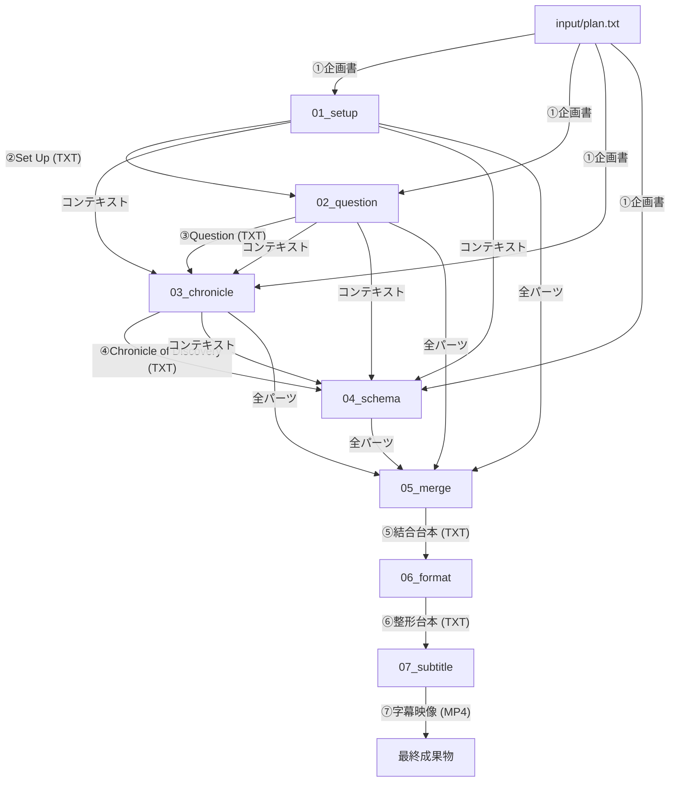

# thb-footage: YouTube台本自動生成システム

YouTubeの実話ストーリー解説系動画の台本制作を自動化するPythonツールです。事実発見を通じて視聴者の価値観や視点を書き換える「4段階ナラティブ構成」を採用し、企画書から高品質な台本を生成します。

## 特徴

- **4段階のナラティブ・パイプライン**: 事実の非対称性を利用した導入から、具体的問いの提示、事実ベースの課題蓄積、そして視聴者自身の「解釈の更新」へと導く一連のストーリーテリング設計。
- **感情・解釈の徹底した暗示化（Show, don't tell）**: 感情的な言葉（恐怖、絶望、怒りなど）や語り手による教訓・解釈の直接的な表現を禁止し、具体的エピソード、数字、情景描写のみで状況を示すことで、視聴者自らに解釈を委ねます。
- **企画書からの直接生成**: 従来の「構成案」作成を廃止し、企画書から各パートを直接執筆することで、ストーリーの熱量と一貫性を維持します。
- **文脈の連鎖（Context Chain）**: 各ステップが前の展開を「文脈」として継承し、流れるようなストーリー構成を実現します。
- **話者識別の自動化**: A（解説者）・B（聞き手）の対話形式を維持し、字幕生成までスムーズに連携。
- **柔軟な制御**: `control.json` により、全自動の `all` 実行から、特定のパートのみの修正まで自由に制御可能。

---

## ナラティブ構成の定義

本システムは以下の4つの物語段階を経て台本を完成させます。

1.  **Set Up（導入）**: 視聴者の常識を裏切り、情報の空白を作ることで、答えを得るまで離脱できない認知状態を生成する。
2.  **Dramatic Question（問い）**: 舞台の報酬・損失構造を暗示的に確立し、具体的な結末を予測せずにいられない問いを刻む。
3.  **Chronicle of Discovery（探究の軌跡）**: 主人公が直面したままならない状況や葛藤を、感情表現を交えずに客観的な事実（数字・出来事・情景）として積み重ね、最終パートに向けた「未解決の課題・矛盾」を蓄積する。
4.  **Schema Update（解決）**: 蓄積された課題を主人公の具体的な決断と行動（事実の連鎖）によって解決させ、視聴者が「これまで持っていた常識や見方」を静かに書き換える（解釈を更新する）体験を提供する。

---

## ナラティブ設計の原則

生成される台本の質を担保するため、以下の設計指針をプロンプトに組み込んでいます。

- **Show, don't tell（示せ、語るな）**: 感情、価値観、状況に対する解釈を語り手が直接語ることを徹底的に排除。すべての心理変化や意味付けは、客観的エピソードや五感を刺激する情景描写（カメラで切り取ったような映像的表現）を通じて暗示的に伝えます。
- **未解決な課題の事実ベースの蓄積**: Chronicleパートでは、エピソードを安易に美化せず、「ままならない構造」として淡々と事実を積み重ねます。解決の兆しと新たな障害によるwave構造により、最終パートのカタルシスを最大化します。
- **事実の解決による「解釈の更新」**: Schemaパートの目的は「感動」ではなく「見え方の変化」です。主人公が結果的に報われなくても、課題の解決を通じて視聴者に静かなカタルシスと認知のアップデートをもたらします。
- **文体の緩急制御**: 課題圧縮フェーズ（カタルシス直前の焦燥感）では、意味の通じる短い主述の文を畳みかけ（体言止めは禁止）、感情解放フェーズ（カタルシス以降）では、1文40〜80文字程度のゆったりとした長文に切り替えて静けさと余韻を演出します。
- **認知科学に基づいたフック**: 感情移入よりも先に、脳の「予測の裏切り」や「情報の非対称性」を利用して視聴者の関心を拘束します。

---

## ディレクトリ構成

```text
.
├── app/                # アプリケーションロジック
│   ├── steps/          # 各工程（Setup, Question, etc.）の実装
│   └── pipeline.py     # パイプライン制御
├── assets/             # フォント、画像等の静的資産
├── config/             # 設定ファイル (control.json, settings.yaml)
├── input/              # 入力データ (plan.txt, 音声素材)
├── output/             # 生成物 (各ステップのTXT, ログ, 最終動画)
├── prompts/            # 各ステップのシステムプロンプト
└── main.py             # 実行エントリーポイント
```

---

## 工程の流れとデータの受け渡し



## 各ステップの依存関係

| ステップ | 主な入力 | 生成される出力 | 役割 |
| :--- | :--- | :--- | :--- |
| **Set Up** | `plan.txt` | `setup.txt` | 導入・感情移入 |
| **Question** | `plan.txt`, `setup.txt` | `question.txt` | 具体的問いの提示 |
| **Chronicle** | `plan.txt`, `setup.txt`, `question.txt` | `chronicle.txt` | 探究と謎の深化 |
| **Schema** | `plan.txt`, `setup.txt`, `question.txt`, `chronicle.txt` | `schema.txt` | 解釈の逆転・解決 |
| **Merge** | 全てのステップTXT | `final_script.txt` | 台本の統合 |
| **Format** | `final_script.txt` | `final_script_formatted.txt` | 読点での改行・話者付与 |
| **Subtitle** | `input/voice/` 内の素材 | `subtitle.mp4` | 字幕付き映像生成 |

---

## セットアップ

### 1. 環境設定
`.env.example` をコピーして `.env` を作成し、Gemini の API キーを設定します。

```bash
cp .env.example .env
# .env を編集して GOOGLE_API_KEY=YOUR_KEY を設定
```

### 2. Docker イメージのビルド
```bash
docker-compose build
```

---

## 使い方 (Docker)

本システムは、すべての工程制御を `config/control.json` で行います。

### 1. 実行手順

1.  **企画書を用意する**: `input/plan.txt` に動画のコンセプトを記入します。
2.  **制御設定を編集する**: `config/control.json` で `next_step` を指定します。
3.  **コマンドを実行する**:
    ```bash
    docker-compose run --rm app python main.py
    ```

### 2. `control.json` の設定

```json
{
    "next_step": "all",
    "plan_file": "input/plan.txt",
    "request": ""
}
```

- **`next_step`**: 実行したいステップ名（`setup`, `question`, `chronicle`, `schema`, `merge`, `format`, `subtitle`）または一括実行の `all`。
- **`request`**: AIへの追加の指示や修正要望がある場合に記入します。

---

## 字幕映像の設定 (Subtitle Step)

`config/settings.yaml` の `subtitle` セクションで字幕のデザインを調整できます。

```yaml
subtitle:
  speakers:
    "アメノちゃん": "#000000" # 話者名に含まれる文字列: 色(HEX)
    "ディアちゃん": "#ff0000"
  font: "assets/font/MPLUSRounded1c-Medium.ttf" # プロジェクト内のフォントパス
  font_size: 40  # フォントサイズ
  bg_color: "white" # 背景色
  width: 1920    # 映像幅
  height: 150    # 映像高さ
  padding_x: 250 # 左右余白（この範囲には文字を入れない）
  silent_duration: 0.25 # 音声終了後の無音期間（秒）
```

### 素材の配置
`input/voice/` ディレクトリに以下の形式でファイルを配置してください。
- `001_名前_タイトル.wav` (音声ファイル)
- `001_名前_タイトル.txt` (字幕テキスト)

※冒頭の3桁の数字でペアリングと再生順序を決定します。

---

## 注意事項
- **Gemini APIの制限**: 生成AIの性質上、出力内容には揺らぎがあります。`config/settings.yaml` の `temperature` で調整してください。
- **ログの確認**: 各生成時のプロンプトと応答は `output/logs/` に詳細に保存されます。
