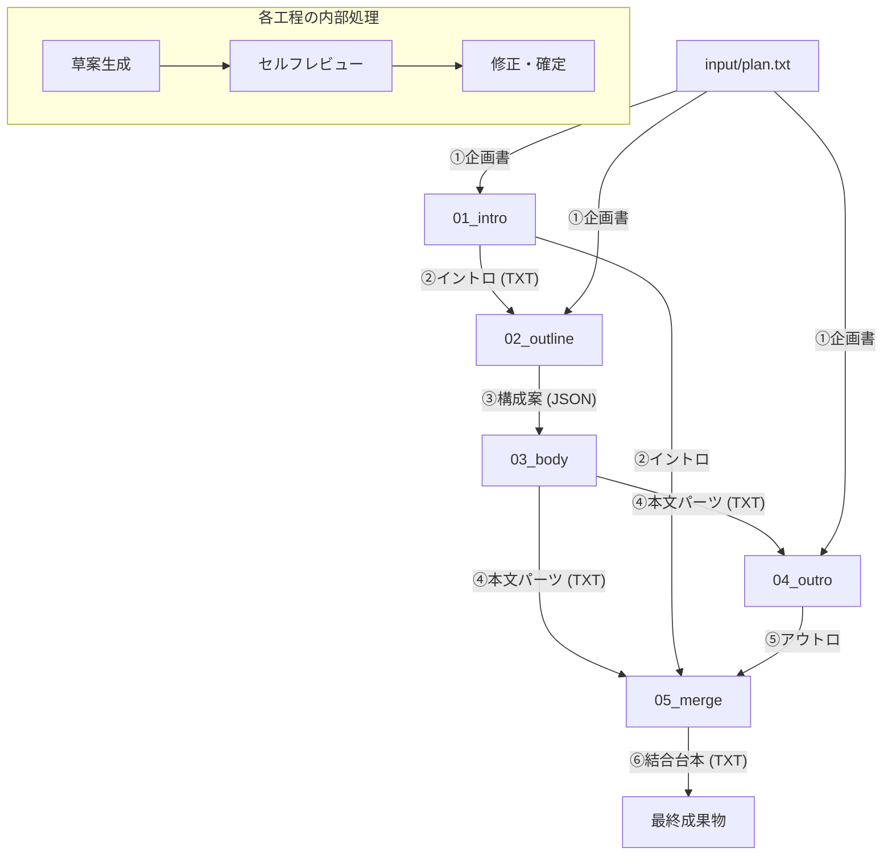

# thb-footage: YouTube台本自動生成システム

YouTubeの実話ストーリー解説系動画の台本制作を自動化するPythonツールです。 Gemini APIを活用し、構成案の作成から詳細な台本の執筆までを連続的、または各工程ごとに実行できます。

## 特徴

- **細分化された5ステップ工程**: 企画書からイントロ、アウトライン、本文、アウトロまでを順番に生成し、各工程で内容を確認・修正できます。
- **推敲ループ（Refinement Loop）**: 各工程で AI が自ら内容を評価・修正し、品質を高めます。
- **文脈維持**: 台本を分割生成する際、直前の内容を保持し、ストーリーの一貫性を確保します。
- **パイプライン設計**: 工程ごとに独立して実行・再開が可能です。
- **Docker対応**: 実行環境の構築が容易です。

---

## 設定（settings.yaml）

`config/settings.yaml` を書き換えることで、モデルや生成動作をカスタマイズできます。

### 1. モデル設定 (`model`)
- `name`: 使用する Gemini モデル（`gemini-1.5-flash`, `gemini-1.5-pro` など）。
- `temperature`: 生成の不確実性（0〜1）。高いほど創造的、低いほど堅実な出力になります。
- `top_p`, `top_k`: 生成精度のためのフィルタリング設定。通常はそのままで問題ありません。
- `max_output_tokens`: 1回のリクエストで出力される最大トークン数。

### 2. パス設定 (`paths`)
- `input_dir`, `output_dir`, `prompt_dir`: 各データの読み込み・保存先ディレクトリを指定します。

### 3. 推敲設定 (`refinement`)
- `max_retries`: （将来的な拡張）生成エラーや品質チェックでのリトライ回数。

---

## 工程の流れとデータの受け渡し

本システムは以下のステップでデータを処理します。



### 2. 構成案生成 (`--step outline`)
- **入力**: 企画書 (`plan.txt`) および イントロ (`intro.txt`)。
- **構成案のデータ例 (JSON)**:
  ```json
  {
    "title": "7度の死を回避した男：フランク・セラク",
    "story_hook": "なぜ世界一不運な男が、最後に世界一の幸運を掴み取れたのか？ その裏に隠された『意図』とは。",
    "sections": [
      {
        "phase": "① 世界と欲望",
        "title": "極寒の脱線事故",
        "description": "1962年、氷点下の列車転落事故。17名が犠牲になる中で、彼だけが生き残った凄惨な現場と、彼の生への執着を描く。",
        "mini_hook": "一命を取り留めた彼を待ち受けていたのは、さらなる不条理な地獄の始まりだった。"
      },
      {
        "phase": "② 挑戦と試行錯誤",
        "title": "高度3000メートルからの墜落",
        "description": "飛行機のドアが吹き飛び、パラシュートなしで空へ放り出されたフランク。生存率0%の絶望的な状況。",
        "mini_hook": "落下中、彼はある『奇跡』を目撃する。それが彼の運命を決定づけた。"
      }
    ]
  }
  ```
- **出力**: `output/02_outline/outline.json`
- **内容**: イントロに続く動画中盤から結末までのセクション構成を、ドラマアーク4の構造に基づいて生成します。

### 3. 本文執筆 (`--step body`)
- **入力**: 構成案 (`outline.json`)。
- **出力**: `output/03_body/part_01.txt`, `part_02.txt` ...
- **内容**: 各セクションの詳細な台本を、前後の繋がりを意識して執筆します。

### 4. アウトロ生成 (`--step outro`)
- **入力**: 企画書 (`plan.txt`) および 本文の内容。
- **出力**: `output/04_outro/outro.txt`
- **内容**: 物語の総括と視聴者へのメッセージを生成します。

### 5. 結合 (`--step merge`)
- **入力**: 生成された全てのパーツ（イントロ、本文、アウトロ）。
- **出力**: `output/05_merge/final_script.txt`
- **内容**: 全てのセクションを一つの完成した台本にまとめます。

---

## セットアップ

### 1. 環境設定
`.env.example` をコピーして `.env` を作成し、Gemini の API キーを設定します。

```bash
cp .env.example .env
# .env を編集して GOOGLE_API_KEY=YOUR_KEY を設定
```

### 2. Docker イメージのビルド
初回実行時や `Dockerfile`、`requirements.txt` を変更した際に実行します。

```bash
docker-compose build
```

---

## 使い方 (Docker)

本システムは Docker コンテナ内での実行を推奨しています。

### 1. コンテナ内での bash 起動（開発・確認用）
コンテナ内に入って直接コマンドを打ちたい場合に使用します。

```bash
# コンテナに入る
docker-compose run --rm app bash

# --- コンテナ内での操作例 ---
# 実行環境の確認
python --version

# スクリプトの実行例
python main.py --step all      # 全工程を一括実行
python main.py --step intro    # イントロのみ生成
python main.py --step outline  # 構成案のみ生成
python main.py --step body     # 本文のみ生成
python main.py --step outro    # アウトロのみ生成
python main.py --step merge    # 最終結合のみ実行
```

### 2. 台本生成コマンドの実行
コンテナを起動して `main.py` を実行します。

```bash
# 全工程を一括実行
docker-compose run --rm app python main.py --step all

# 特定の工程のみ実行
docker-compose run --rm app python main.py --step intro
```

### コマンドライン引数の詳細

| 引数 | 説明 | デフォルト値 |
| :--- | :--- | :--- |
| `--step` | 実行する工程を指定（`all`, `intro`, `outline`, `body`, `outro`, `merge`） | `all` |
| `--input` | 入力ファイル（企画書または中間データ）のパス | `input/plan.txt` |
| `--config` | 設定ファイル（settings.yaml）のパス | `config/settings.yaml` |

#### `--step` ごとの推奨実行順序と入力
1. **`intro`**: `input/plan.txt` を用意して実行。
2. **`outline`**: 完了したイントロを確認・修正後に実行。
3. **`body`**: 完了した構成案を確認・修正後に実行。
4. **`outro`**: 完了した本文を確認・修正後に実行。
5. **`merge`**: 全てが揃った状態で実行。

---

## カスタマイズ（プロンプト）

`prompts/` フォルダ内のテキストファイルを編集することで、AI への指示を調整できます。各工程で以下のプレースホルダーが使用可能です。

### 1. イントロ生成 (`prompts/intro/`)
- `{plan}`: 企画書の内容（plan.txt）。

### 2. 構成案生成 (`prompts/outline/`)
- `{plan}`: 企画書の内容。
- `{intro}`: 生成（修正）されたイントロ原稿。

### 3. 本文執筆 (`prompts/body/`)
- `{title}`: セクションの題名。
- `{description}`: セクションの概要。
- `{context}`: **直前のセクションの台本**。

### 4. アウトロ生成 (`prompts/outro/`)
- `{plan}`: 企画書の内容。
- `{body_content}`: これまでに執筆された本文の内容。

---

## 推敲ループの仕組み
各ディレクトリ（`intro`, `outline`, `body`, `outro`）には以下の3つのファイルがあります。

1. `draft.txt`: AI が最初に生成する草案用のプロンプト。
2. `review.txt`: 生成された草案を AI 自身が批評するためのプロンプト。
3. `finalize.txt`: 批評を元に最終稿を仕上げるためのプロンプト。

これらを編集することで、「どのような視点でレビューするか」「最終的にどのようなトーンを目指すか」を細かく制御できます。
