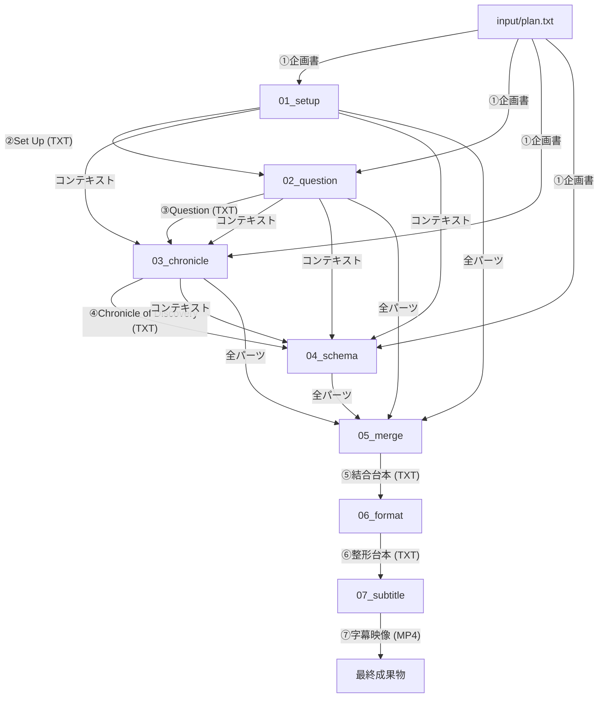

# 解説動画台本〜字幕生成サービス (`narrative-script`)

本サービスは、YouTubeの実話ストーリー解説系動画の台本制作を自動化するPythonツールです。事実発見を通じて視聴者の価値観や視点を書き換える「4段階ナラティブ構成」を採用し、企画書から高品質な台本および音声結合字幕動画（MP4）を生成します。

---

## ナラティブ構成の定義

本システムは以下の4つの物語段階を経て台本を完成させます。

1. **Set Up（導入）**: 視聴者の常識を裏切り、情報の空白を作ることで、答えを得るまで離脱できない認知状態を生成します。
2. **Dramatic Question（問い）**: 舞台の報酬・損失構造を暗示的に確立し、具体的な結末を予測せずにいられない問いを刻みます。
3. **Chronicle of Discovery（探究の軌跡）**: 主人公が直面したままならない状況や葛藤を、感情表現を交えずに客観的な事実（数字・出来事・情景）として積み重ね、最終パートに向けた「未解決の課題・矛盾」を蓄積します。
4. **Schema Update（解決）**: 蓄積された課題を主人公の具体的な決断と行動（事実の連鎖）によって解決させ、視聴者が「これまで持っていた常識や見方」を静かに書き換える（解釈を更新する）体験を提供します。

---

## ナラティブ設計の原則

生成される台本の質を担保するため、以下の設計指針をプロンプトに組み込んでいます。

- **Show, don't tell（示せ、語るな）**: 感情、価値観、状況に対する解釈を語り手が直接語ることを徹底的に排除します。すべての心理変化や意味付けは、客観的エピソードや五感を刺激する情景描写（カメラで切り取ったような映像的表現）を通じて暗示的に伝えます。
- **未解決な課題の事実ベースの蓄積**: Chronicleパートでは、エピソードを安易に美化せず、「ままならない構造」として淡々と事実を積み重ねます。解決の兆しと新たな障害によるwave構造により、最終パートのカタルシスを最大化します。
- **事実の解決による「解釈の更新」**: Schemaパートの目的は「感動」ではなく「見え方の変化」です。主人公が結果的に報われなくても、課題の解決を通じて視聴者に静かなカタルシスと認知のアップデートをもたらします。
- **文体の緩急制御**: 課題圧縮フェーズ（カタルシス直前の焦燥感）では、意味の通じる短い主述の文を畳みかけ（体言止めは禁止）、感情解放フェーズ（カタルシス以降）では、1文40〜80文字程度のゆったりとした長文に切り替えて静けさと余韻を演出します。
- **認知科学に基づいたフック**: 感情移入よりも先に、脳の「予測の裏切り」や「情報の非対称性」を利用して視聴者の関心を拘束します。

---

## 工程の流れとデータの受け渡し



### 各ステップの依存関係

| ステップ | 主な入力 | 生成される出力 | 役割 |
| :--- | :--- | :--- | :--- |
| **Set Up** | `plan.txt` | `setup.txt` | 導入・感情移入 |
| **Question** | `plan.txt`, `setup.txt` | `question.txt` | 具体的問いの提示 |
| **Chronicle** | `plan.txt`, `setup.txt`, `question.txt` | `chronicle.txt` | 探究と謎の深化 |
| **Schema** | `plan.txt`, `setup.txt`, `question.txt`, `chronicle.txt` | `schema.txt` | 解釈の逆転・解決 |
| **Merge** | 全てのステップTXT | `final_script.txt` | 台本の統合 |
| **Format** | `final_script.txt` | `final_script_formatted.txt` | 読点での改行・話者付与 |
| **Subtitle** | `input/voice/` 内の素材 | `subtitle.mp4` | 字幕付き映像生成 |

---

## 設定の詳細

### 1. `config/settings.yaml` の調整
字幕のレイアウトやフォント、各話者の字幕表示色を設定できます。

```yaml
subtitle:
  speakers:
    "アメノちゃん": "#9D0C0C" # 話者名に含まれる文字列: 色(HEX)
    "ディアちゃん": "#004F6E"
  font: "assets/font/MPLUSRounded1c-Medium.ttf" # サービス内のフォントパス
  font_size: 40  # フォントサイズ
  bg_color: "white" # 背景色
  width: 1920    # 映像幅
  height: 150    # 映像高さ
  padding_x: 250 # 左右余白（この範囲には文字を入れない）
  silent_duration: 0.25 # 音声終了後の無音期間（秒）
```

### 2. 素材の配置ルール
`input/voice/` ディレクトリに以下の形式でファイルを配置してください。

- `001_名前_タイトル.wav` (音声ファイル)
- `001_名前_タイトル.txt` (字幕テキスト)

※冒頭の3桁の数字（`001`, `002`...）でペアリングと再生順序を自動的に決定します。

---

## 注意事項

- **Gemini APIの制限**: 生成AIの性質上、出力内容には揺らぎがあります。安定させたい場合は `config/settings.yaml` の `temperature` を低めに調整してください。
- **ログの確認**: 各生成時のプロンプトと応答の詳細は `output/logs/` に詳細に保存されます。デバッグやプロンプト調整の際に活用してください。

---

## 企画書テンプレートの活用

台本生成のクオリティを高めるため、入力となる `plan.txt` の書き方の指針としてテンプレートを用意しています。

1. **テンプレートのコピー**:
   `services/narrative-script/input/plan_template.txt` をコピーして、同ディレクトリに `plan.txt` を作成します。
2. **構成要素の記述**:
   テンプレートには、動画のテーマ、ターゲット視聴者、主人公の初期状態（常識）、裏切る事実、解決する行動などのプロット設計シートが含まれています。これらを詳細に記述することで、Gemini がより意図に沿った高品質な4段階ナラティブ台本を生成します。

---

## 中間ファイルと生成のやり直し手順

本サービスはステップ単位で実行を制御でき、生成された中間ファイルは `services/narrative-script/output/` 内にそれぞれ保存されます。

### 中間出力のディレクトリ構成
* `01_setup/setup.txt`: 導入（Set Up）部分の台本
* `02_question/question.txt`: 問い（Dramatic Question）部分の台本
* `03_chronicle/chronicle.txt`: 探究（Chronicle）部分の台本
* `04_schema/schema.txt`: 解決（Schema Update）部分の台本
* `05_merge/final_script.txt`: 結合された一本の台本
* `06_format/final_script_formatted.txt`: 話者（A, B）および読点改行が適用された整形済み台本
* `07_subtitle/subtitle.mp4`: 字幕付き合成映像（最終出力）

### 途中のステップからやり直す場合
例えば、「導入（Set Up）と問い（Question）の出来は良いが、探究（Chronicle）以降をもう一度AIに生成し直させたい」という場合は、以下の手順でやり直すことができます。

1. `output/03_chronicle/` 以降のフォルダ内にある生成されたテキストファイルを削除（または退避）します。
2. `config/control.json` の設定を以下のように編集します。
   ```json
   {
       "next_step": "chronicle",
       "plan_file": "input/plan.txt",
       "request": "（必要に応じて追加の指示を入力）"
   }
   ```
3. 実行コマンドを実行します。
   ```bash
   docker-compose run --rm narrative-script python main.py
   ```
   ※ `setup.txt` と `question.txt` はすでに `output/` 内に存在するため、それらの生成ステップはスキップされ、既存のファイルをコンテキストとして読み込んだ上で `chronicle` ステップから処理が再開されます。

---

## トラブルシューティング

### ① Gemini API のレートリミットエラー（429 Too Many Requests 等）が発生する
* **原因**: 短時間に大量のトークンを送信したか、APIキーの利用制限（無料枠など）に達した可能性があります。
* **対策**: 一括実行（`"next_step": "all"`）ではなく、`control.json` の `next_step` を `setup` -> `question` -> `chronicle` -> `schema` のように1ステップずつ手動で切り替えて実行し、ステップ間に少し時間を置くようにしてください。

### ② 字幕動画（MP4）の文字が `□□`（豆腐）に文字化けする
* **原因**: 字幕生成時に指定された日本語フォントがコンテナ内に存在しないか、パスが間違っています。
* **対策**: `services/narrative-script/assets/font/` ディレクトリに、日本語に対応した TrueType フォント（`.ttf`）または OpenType フォント（`.otf`）が正しく配置されているか確認してください。また、`config/settings.yaml` の `subtitle.font` にそのフォントへの正しい相対パスが記述されているか確認してください。

### ③ shared モジュールのインポートエラー（ModuleNotFoundError）が出る
* **原因**: Dockerイメージのビルド時に、共通ライブラリ `shared/` がコンテナ内にコピーされていない可能性があります。
* **対策**: サービス単体のディレクトリではなく、必ずプロジェクトルート（`.`）をビルドコンテキストとしてビルドを行ってください。
  * 誤り: `docker build -t narrative-script services/narrative-script/` (共通ライブラリが含まれません)
  * 正しいビルド方法: `docker-compose build narrative-script`（`docker-compose.yml` でコンテキストがプロジェクトルートに定義されています）
